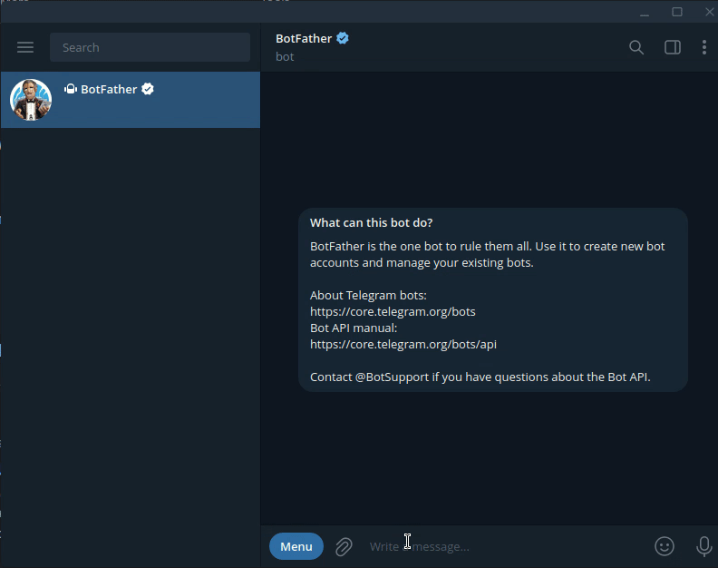
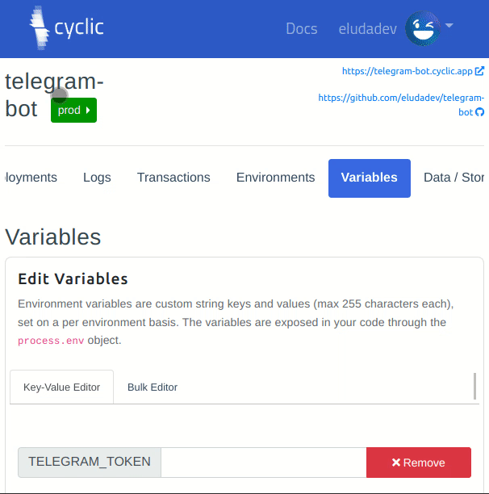
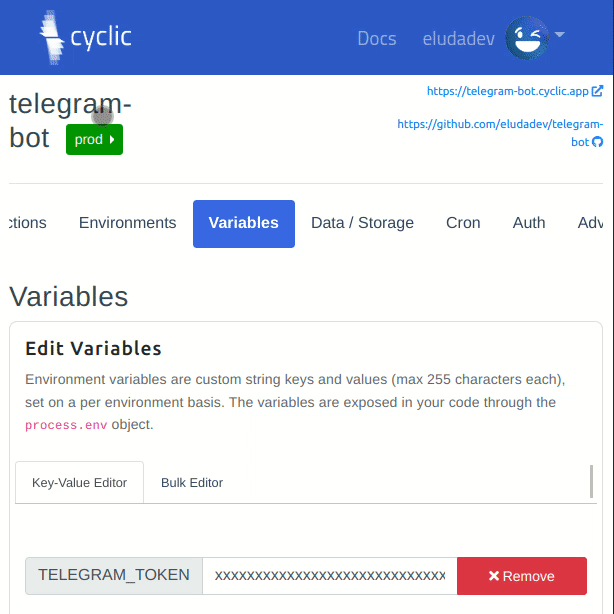
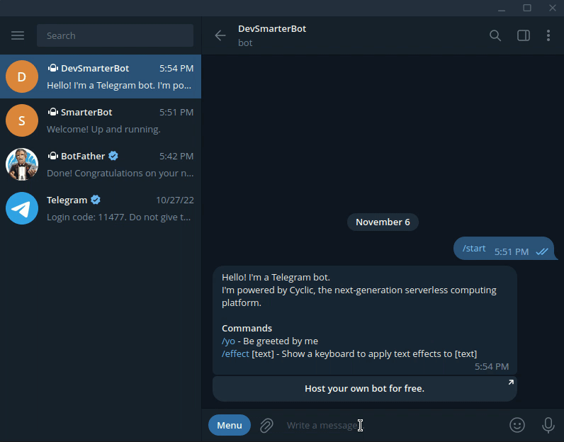
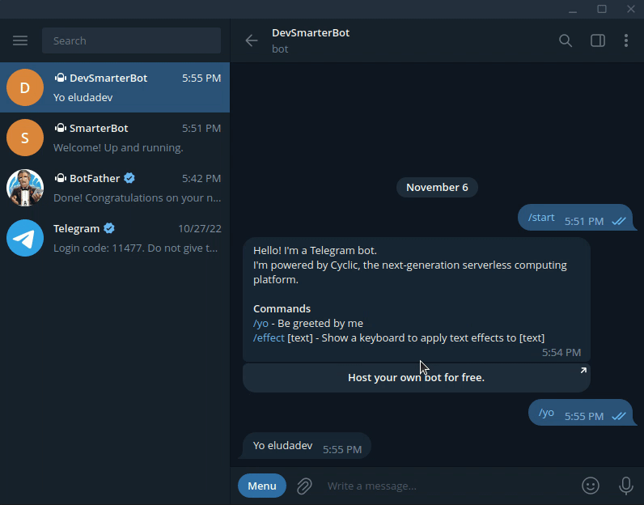
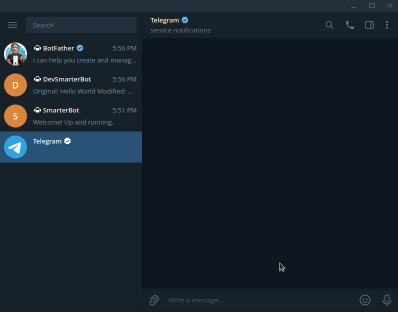

# Telegram Bot, built on Cyclic 🤖

Say hello to the Telegram Bot template! Built on the [grammY](https://grammy.dev/) framework and hosted by the [Cyclic](https://www.cyclic.sh/) serverless platform.

- Handling Inline Queries.
- Responding to commands.
- Interactive Inline Keyboards.

Try it out now! [\@CyclicDemoBot](http://t.me/CyclicDemoBot)

<p align="center"></p>


## Deployment

### Prerequisites

Make sure that you have the following programs installed on your own local machine.

- [Telegram Client](https://desktop.telegram.org/).
- cURL.

### Step 1 — Deploy on Cyclic 🚀

Take your new Telegram bot live with one click. \
**Free hosting. No credit card required.**

[](https://deploy.cyclic.sh/eludadev/telegram-bot)

<p align="center"></p>

### Step 2 — Configure environment variables

1. Grab your Telegram bot's API token by sending a message to [\@BotFather](https://telegram.me/BotFather).
<p align="center"></p>

2. Add that API token to your Cyclic deployment's environment variables.
<p align="center"></p>

3. Set the `NODE_ENV` environment variable to `production`.
<p align="center"></p>

### Step 3 — Link the bot with your new server

Connect your Telegram bot to your server by sending the following HTTP request using your terminal:

#### Linux / MacOS

```bash
export TELEGRAM_API_TOKEN=... # YOUR TELEGRAM API TOKEN
export TELEGRAM_WEBHOOK_URL=... # YOUR CYCLIC DEPLOYMENT URL

curl "https://api.telegram.org/bot$TELEGRAM_API_TOKEN/setWebhook?url=$TELEGRAM_WEBHOOK_URL"
```

## How to run it locally?

### Prerequisites

- Node.
- Yarn.
- [Telegram Client](https://desktop.telegram.org/).

### Local installation

1. Clone the repository to your machine: `git clone https://github.com/eludadev/telegram-bot && cd telegram-bot`
2. Grab your bot's API token by messaging [\@BotFather](https://telegram.me/BotFather). (see above)
3. Create the file `.env` and add the following line:
```bash
TELEGRAM_TOKEN=... # YOUR TELEGRAM API TOKEN
```
4. Download dependencies: `yarn`
5. Start your bot: `yarn dev`

## Usage Examples

### Being greeted by the bot

<p align="center"></p>


### Applying text effects

<p align="center"></p>


### Invoking the bot in other chats

> **Note**
> This feature is also known as [Inline Queries](https://core.telegram.org/api/bots/inline).

<p align="center"></p>
